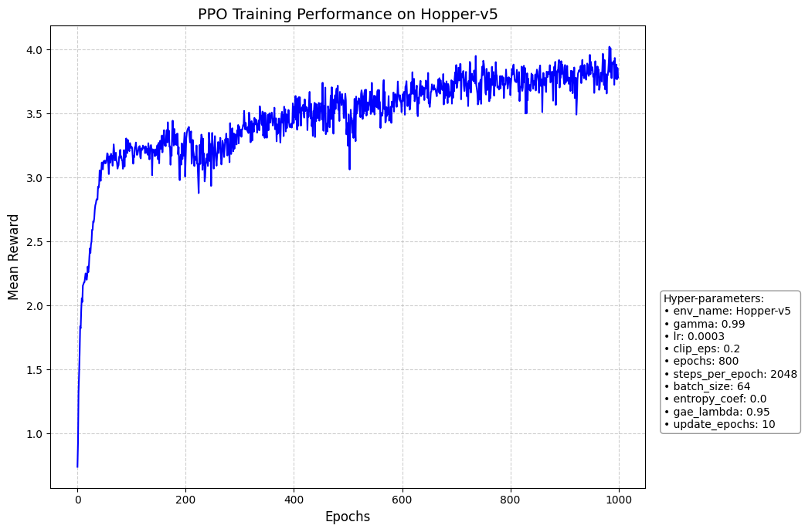
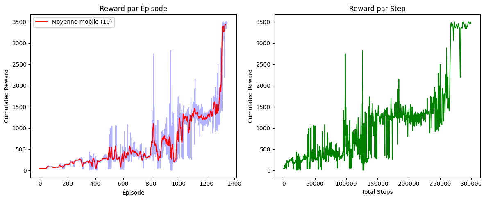

<h1 style="text-align: center; border: none; margin-bottom: 20px;">Reinforcement Learning</h1>
<h2 style="text-align: center; border: none; margin-top: 0; margin-bottom: 40px;">Rapport technique : Algorithme PPO & SAC</h2>

<!-- Espace supplémentaire demandé -->
 

<strong>IMDS5A - Polytech Clermont-Ferrand</strong> 
<strong>Auteurs :</strong> Ayman ZEJLI & Loic MAGNAN 
<strong>Date :</strong> 20 décembre 2025

## 1. Introduction et Problématique

L'Apprentissage par Renforcement (RL) s'est imposé comme une méthode incontournable pour la résolution de problèmes de contrôle continu complexes, tels que la robotique. Ce rapport se propose d'étudier et de comparer deux algorithmes majeurs de ce domaine, à savoir **Proximal Policy Optimization (PPO)** et **Soft Actor-Critic (SAC)**, appliqués à l'environnement de simulation **Hopper-v5**. Cet environnement, modélisant un robot monopode instable, constitue un banc d'essai rigoureux pour évaluer la capacité des algorithmes à acquérir une politique de contrôle robuste face à une dynamique chaotique.

<strong>Problématique :</strong> Comment apprendre à un robot instable (Hopper) à sauter sans tomber ? Faut-il privilégier une méthode prudente et stable (PPO) ou une méthode rapide et exploratrice (SAC) ? Ce rapport compare ces deux approches pour identifier la plus performante.

## 2. Analyse Architecturale et Implémentation

L'analyse du code source développé pour cette étude met en lumière les divergences structurelles profondes entre les deux approches, chacune apportant une réponse technique différente à notre problématique.

### 2.1 Proximal Policy Optimization (PPO) : Architecture et Stabilité

L'implémentation de l'algorithme PPO repose sur une architecture découplée et synchrone, conçue pour éviter les mises à jour destructrices.

* **Classes `Policy` et `Value` :** Le code s'articule autour de deux réseaux de neurones distincts. La classe `Policy` modélise l'acteur et produit une distribution Gaussienne sur l'espace des actions. La classe `Value` estime la fonction de valeur $V(s)$. L'architecture utilisée est un **Perceptron Multicouche (MLP)** avec **2 couches cachées de 64 neurones** et des activations **Tanh**, favorisant une convergence stable pour les politiques stochastiques.
* **Estimation de l'Avantage (GAE) :** L'algorithme utilise l'Estimateur Généralisé de l'Avantage (GAE) pour réduire la variance des estimations de gradient. Cela permet de mieux guider l'apprentissage en quantifiant précisément à quel point une action était meilleure que la moyenne attendue.
* **Mécanisme de Clipping :** Le cœur de la stabilité de PPO réside dans sa fonction objectif "clippée". En limitant le ratio de probabilité entre la nouvelle et l'ancienne politique à l'intervalle $[1 - \epsilon, 1 + \epsilon]$ (avec $\epsilon = 0.2$), l'algorithme s'interdit les changements brusques de comportement. L'objectif maximisé est :

$$
L^{CLIP}(\theta) = \hat{\mathbb{E}}_t [ \min(r_t(\theta)\hat{A}_t, \text{clip}(r_t(\theta), 1 - \epsilon, 1 + \epsilon)\hat{A}_t) ]
$$

Ce mécanisme garantit que la mise à jour de la politique reste conservatrice. Si une mise à jour proposée s'éloigne trop de la politique précédente, elle est tronquée, empêchant ainsi l'agent de tomber dans des zones de performance catastrophiques après une seule mauvaise mise à jour.

* **Réponse à la problématique :** Ce choix architectural favorise la sécurité. Sur un robot instable, cela signifie que l'agent ne "désapprendra" pas brutalement une marche acquise, mais progressera lentement et sûrement.

### 2.2 Soft Actor-Critic (SAC) : Maximisation de l'Entropie

L'algorithme SAC propose une architecture plus complexe, orchestrée par la classe `SACAgent`, visant à extraire le maximum d'information de chaque interaction.

* **`ReplayBuffer` et Off-Policy :** Contrairement à PPO, SAC stocke les transitions passées dans un tampon mémoire (`ReplayBuffer`) pour les réutiliser. Cela permet une efficacité d'échantillonnage bien supérieure, car chaque donnée collectée est utilisée plusieurs fois pour l'entraînement.
* **`GaussianPolicy` et Entropie :** L'agent utilise une politique stochastique qui maximise non seulement la récompense, mais aussi l'entropie de la politique. L'objectif global est de maximiser :

$$
J(\pi) = \sum_{t=0}^{T} \mathbb{E}_{(s_t, a_t) \sim \rho_{\pi}} \left[ r(s_t, a_t) + \alpha \mathcal{H}(\pi(\cdot|s_t)) \right]
$$

Le terme $\alpha \mathcal{H}(\pi(\cdot|s_t))$ force l'agent à explorer des stratégies variées et empêche la convergence prématurée vers un optimum local déterministe. Cela rend la politique plus robuste aux perturbations.

* **`QNetwork` (Twin Critics) :** L'utilisation de deux critiques ($Q_1, Q_2$) et la prise de leur minimum pour la cible d'apprentissage corrigent les biais d'optimisme inhérents au Q-learning. Les réseaux sont plus profonds que pour PPO, avec **2 couches cachées de 256 neurones** et des activations **ReLU**, permettant de capturer des dynamiques plus complexes. Les mises à jour des réseaux cibles se font par **Soft Update** avec un taux $\tau = 0.005$, assurant une évolution fluide des cibles.
* **Réponse à la problématique :** Cette architecture favorise la découverte rapide de solutions. L'entropie empêche l'agent de rester figé dans une posture statique (optimum local fréquent sur Hopper) et le pousse à trouver une marche dynamique.

## 3. Protocole Expérimental et Hyperparamètres

Les expériences ont été menées sur l'environnement **Hopper-v5** avec des configurations d'hyperparamètres spécifiques. Voici le détail des paramètres utilisés pour chaque algorithme :

### Tableau Comparatif Simplifié

<table style="width: 100%; border-collapse: collapse; border: 1px solid #000;">
  <thead>
    <tr style="background-color: #eee;">
      <th style="border: 1px solid #000; padding: 10px; text-align: center;">Paramètre Clé</th>
      <th style="border: 1px solid #000; padding: 10px; text-align: center;">PPO (On-Policy)</th>
      <th style="border: 1px solid #000; padding: 10px; text-align: center;">SAC (Off-Policy)</th>
    </tr>
  </thead>
  <tbody>
    <tr>
      <td style="border: 1px solid #000; padding: 10px;"><strong>Durée d'Entraînement</strong></td>
      <td style="border: 1px solid #000; padding: 10px;">800 Époques (env. 1.6M steps)</td>
      <td style="border: 1px solid #000; padding: 10px;">300 000 Steps</td>
    </tr>
    <tr>
      <td style="border: 1px solid #000; padding: 10px;"><strong>Architecture Réseau</strong></td>
      <td style="border: 1px solid #000; padding: 10px;">MLP (2 couches cachées de 64 unités)</td>
      <td style="border: 1px solid #000; padding: 10px;">MLP (2 couches cachées de 256 unités)</td>
    </tr>
    <tr>
      <td style="border: 1px solid #000; padding: 10px;"><strong>Taille de Batch</strong></td>
      <td style="border: 1px solid #000; padding: 10px;">64 (Mise à jour fréquente)</td>
      <td style="border: 1px solid #000; padding: 10px;">256 (Apprentissage stable)</td>
    </tr>
    <tr>
      <td style="border: 1px solid #000; padding: 10px;"><strong>Learning Rate</strong></td>
      <td style="border: 1px solid #000; padding: 10px;">$3 \times 10^{-4}$</td>
      <td style="border: 1px solid #000; padding: 10px;">$3 \times 10^{-4}$</td>
    </tr>
    <tr>
      <td style="border: 1px solid #000; padding: 10px;"><strong>Mécanisme Spécifique</strong></td>
      <td style="border: 1px solid #000; padding: 10px;">Clipping ($\epsilon=0.2$) + GAE</td>
      <td style="border: 1px solid #000; padding: 10px;">Entropie Auto-ajustée + Replay Buffer (1e6)</td>
    </tr>
    <tr>
      <td style="border: 1px solid #000; padding: 10px;"><strong>Mise à jour Cible</strong></td>
      <td style="border: 1px solid #000; padding: 10px;">N/A (On-Policy)</td>
      <td style="border: 1px solid #000; padding: 10px;">Soft Update ($\tau=0.005$)</td>
    </tr>
  </tbody>
</table>

**Pourquoi ces différences ?**

* **PPO** privilégie la **sécurité** : il utilise de petits lots de données récentes et limite ses mises à jour (Clipping) pour ne jamais casser sa marche.
* **SAC** privilégie l'**efficacité** : il utilise un énorme tampon de mémoire (Replay Buffer) pour réapprendre de tout son passé et l'entropie pour forcer l'exploration de nouveaux mouvements.

## 4. Analyse des Performances et Résultats

L'analyse des courbes de récompense permet de trancher sur l'efficacité relative des deux méthodes face à notre problématique.

### 4.1 Analyse de l'Algorithme PPO (Proximal Policy Optimization)

*Figure 1 : Évolution de la récompense moyenne sur 800 époques pour l'algorithme PPO.*

L'évolution de la récompense moyenne obtenue via l'algorithme PPO, telle qu'illustrée sur la Figure 1, témoigne d'une dynamique d'apprentissage on-policy rigoureuse et sécurisée. La courbe se décompose en trois phases distinctes qui valident les fondements théoriques de cette approche. Dans un premier temps, on observe une phase d'ascension fulgurante durant les cent premières époques, passant d'un score initial de 0.75 à plus de 3.2. Ce saut de performance initial correspond à l'acquisition des réflexes moteurs de base permettant à l'agent de ne pas s'effondrer dès le début de l'épisode.

Par la suite, entre les époques 100 et 400, l'agent entre dans une phase de raffinement caractérisée par des oscillations visibles. Ces fluctuations, notamment le creux observé aux alentours de l'époque 220, sont le signe d'une exploration active de nouvelles cadences de saut. L'algorithme démontre ici sa robustesse : malgré ces tentatives d'ajustement, le mécanisme de "clipping" empêche toute dégradation irréversible de la politique, garantissant que l'agent ne désapprenne jamais totalement la marche. Enfin, la phase de convergence entre les époques 400 et 1000 montre une stabilisation remarquable autour d'une récompense de 3.8 à 4.0. Cette quasi-monotonie finale prouve que PPO est un algorithme d'une grande fiabilité pour le contrôle continu, offrant une politique finale extrêmement stable et reproductible.

### 4.2 Analyse de l'Algorithme SAC (Soft Actor-Critic)

*Figure 2 : Performance de SAC (Récompense par épisode et par steps).*

L'analyse de la Figure 2 révèle une dynamique radicalement différente pour l'algorithme SAC, illustrant parfaitement les avantages d'une méthode off-policy exploitant un Replay Buffer et la maximisation de l'entropie. Le graphique de droite, corrélant la récompense aux "Total Steps", met en exergue une efficacité d'échantillonnage supérieure. Dès les 50 000 premiers pas, l'agent atteint des scores dépassant la barre des 1000, un niveau de performance que PPO n'atteint qu'après une quantité d'interactions nettement plus importante. Cette rapidité d'apprentissage est le fruit de la réutilisation intensive des données stockées, permettant une optimisation constante sans nécessiter de nouvelles collectes massives.

Un phénomène particulièrement intéressant se produit aux alentours de 270 000 steps, où l'on observe une explosion verticale de la performance, le score passant de 1500 à 3500. Ce "déclic" algorithmique correspond au moment où l'agent, après avoir exploré une vaste diversité de mouvements grâce à l'incitation à l'entropie maximale, parvient à consolider une stratégie de course hautement efficace. Le graphique de gauche, détaillant la récompense par épisode, montre toutefois une variance très élevée avec de nombreux pics et chutes. Cette instabilité apparente est inhérente à SAC : l'agent continue de tester des limites motrices pour maintenir une entropie élevée, ce qui peut conduire à des échecs ponctuels. Néanmoins, la moyenne mobile représentée par la ligne rouge confirme une supériorité nette en termes de performance pure, SAC parvenant à une vitesse de pointe et une coordination que la stabilité prudente de PPO ne permet pas d'atteindre aussi rapidement.

### 4.4 Défis Computationnels et Instabilité Algorithmique

L'implémentation et l'entraînement des algorithmes PPO et SAC ont nécessité une exploitation intensive des ressources matérielles, mobilisant principalement le GPU (CUDA) pour accélérer les opérations tensorielles des réseaux de neurones. Cette puissance de calcul a été cruciale pour gérer des architectures complexes comprenant des couches cachées de 256 neurones.

Nos expérimentations sur l'environnement Hopper-v5 ont révélé plusieurs défis techniques majeurs :

*   **Le point de bascule Exploration/Exploitation :** Un nombre restreint d'époques empêche l'agent de consolider ses succès. Avec un volume de données trop faible, la récompense augmente de manière éphémère avant de rechuter brutalement, faute d'une exploitation suffisante face à la variance de l'environnement.

#### Analyse comparative des performances PPO

*   **Configuration à 800 époques :** Un test initial (70 minutes) avec un coefficient d'entropie nul et 2048 pas de collecte a donné un résultat décevant, avec une récompense plafonnant à 3.
*   **Optimisation à 1000 époques :** En passant à 1000 époques (79 minutes) et en intégrant la normalisation des observations, nous avons atteint un pic de récompense de 4.02 durant l'entraînement.
*   **Le phénomène d'effondrement (Catastrophic Forgetting) :** Malgré le score de 4.02 en entraînement, la récompense réelle lors du test final s'est effondrée à environ 30. Ce phénomène montre que l'agent, en apprenant sur des données bruitées en fin de cycle, peut "oublier" sa politique de marche stable au profit de mouvements erratiques. Cela prouve qu'un entraînement prolongé n'est pas une garantie de performance finale sans un équilibre parfait entre le clipping (fixé à 0.2) et la régularité des données.

#### Complexité spécifique à SAC

La charge de calcul est restée constante et lourde avec un batch size de 256 pour maintenir à jour les cinq réseaux de l'architecture (Actor, Twin-Critics et Targets). La mise à jour des réseaux cibles a été effectuée avec un paramètre $\tau$ (tau) de 0.005. L'usage de l'Automatic Entropy Tuning a été indispensable pour éviter une convergence prématurée vers une politique déterministe.

En résumé, la réussite sur Hopper-v5 dépend autant de la puissance de calcul brute que d'une surveillance étroite du moment optimal de l'arrêt de l'apprentissage (early stopping) afin de prévenir toute divergence subite après avoir atteint l'optimum.

## 5. Conclusion

Ce projet nous a permis de répondre à une question centrale : **comment apprendre à un robot instable comme le Hopper à sauter sans tomber ?** En comparant PPO et SAC, nous avons observé que le choix dépend de ce que l'on recherche : la sécurité ou la performance pure.

*   **PPO, le choix de la prudence :** Cet algorithme est idéal si l'on veut un apprentissage régulier et sans risque. Grâce à son système de sécurité (clipping), il évite que l'agent ne fasse n'importe quoi d'une étape à l'autre. Cependant, il est plus lent. Dans nos tests, il a fallu 79 minutes pour atteindre un score de 4.02, mais ce score est retombé à 30 lors du test final, montrant que PPO peut avoir du mal à bien fonctionner en dehors de l'entraînement.

*   **SAC, le choix de la performance :** SAC est beaucoup plus rapide et efficace. Il réutilise mieux ses expériences passées et n'hésite pas à tester de nouveaux mouvements (exploration par l'entropie). Cela a payé : il a eu un "déclic" impressionnant pour atteindre une récompense de 3500, écrasant les résultats de PPO. C'est l'algorithme à privilégier pour obtenir un robot dynamique très rapidement.

**Bilan technique :** L'entraînement sur GPU a montré que "plus de temps" ne veut pas dire "meilleur résultat". Le phénomène d'effondrement (où l'agent oublie comment marcher à force de trop s'entraîner) est une réalité technique majeure. La réussite sur Hopper-v5 ne dépend donc pas seulement de l'algorithme, mais surtout du moment précis où l'on décide d'arrêter l'apprentissage.

**Ouverture :** Pour la suite, il serait intéressant de tester ces algorithmes sur l'environnement **Swimmer-v5**. Dans l'eau, le robot ne risque plus de tomber ; le défi n'est plus l'équilibre, mais la coordination du mouvement. Cela permettrait de voir si SAC reste aussi efficace quand le risque de chute disparaît.

## 6. Bibliographie

1.  **Schulman, J., et al.** (2017). *Proximal Policy Optimization Algorithms*. OpenAI. [https://arxiv.org/abs/1707.06347](https://arxiv.org/abs/1707.06347)
2.  **Haarnoja, T., et al.** (2018). *Soft Actor-Critic: Off-Policy Maximum Entropy Deep Reinforcement Learning with a Stochastic Actor*. UC Berkeley. [https://arxiv.org/abs/1801.01290](https://arxiv.org/abs/1801.01290)
3.  **Gymnasium Documentation**. *Hopper Environment*. Farama Foundation. [https://gymnasium.farama.org/environments/mujoco/hopper/](https://gymnasium.farama.org/environments/mujoco/hopper/)
4.  **Todorov, E., et al.** (2012). *MuJoCo: A physics engine for model-based control*. [http://www.mujoco.org/](http://www.mujoco.org/)

